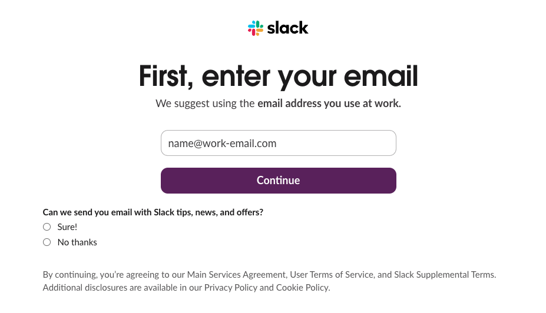
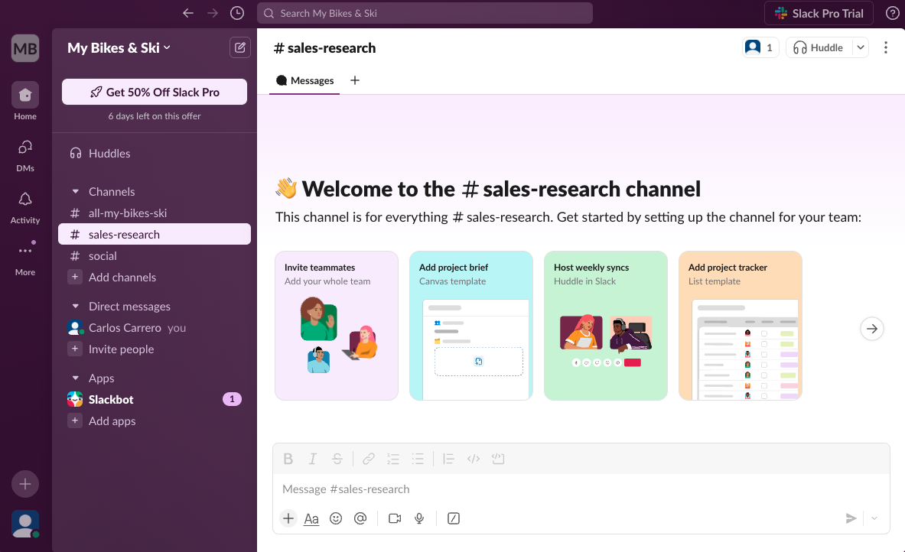
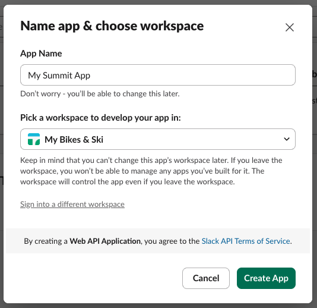
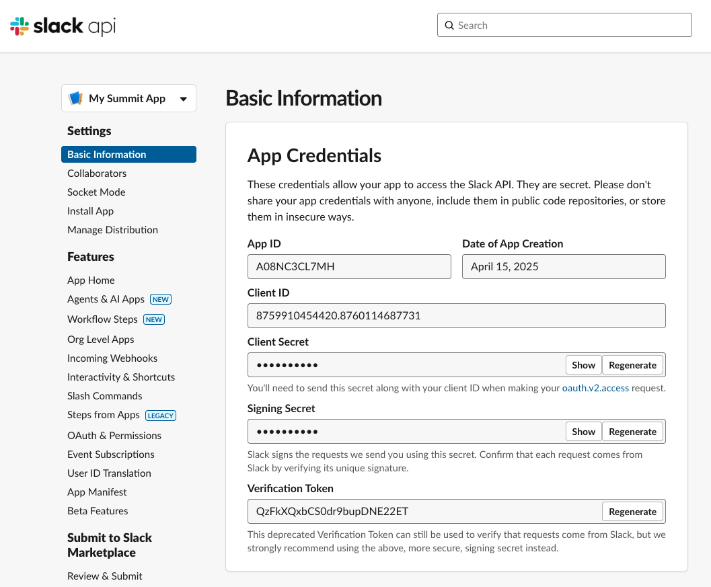
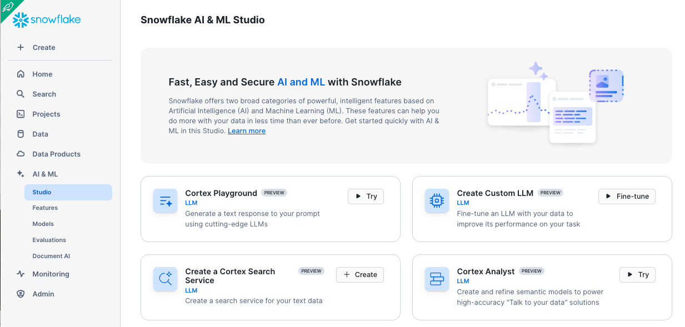
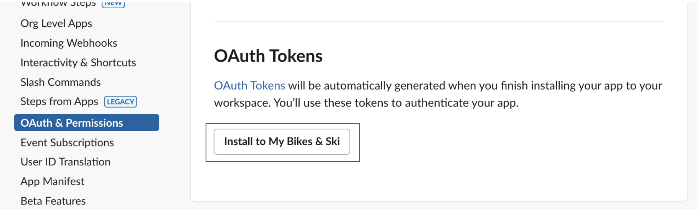
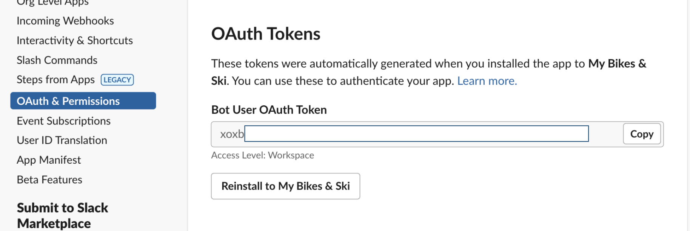
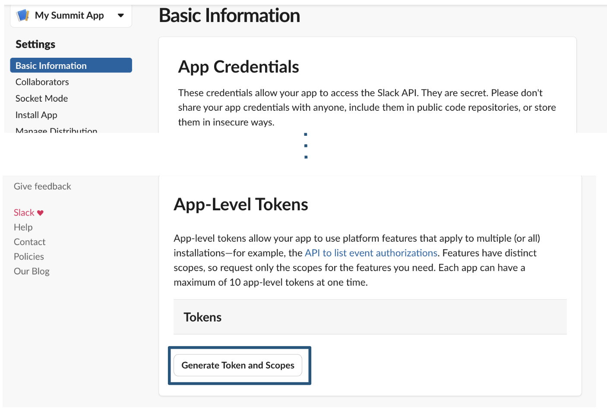
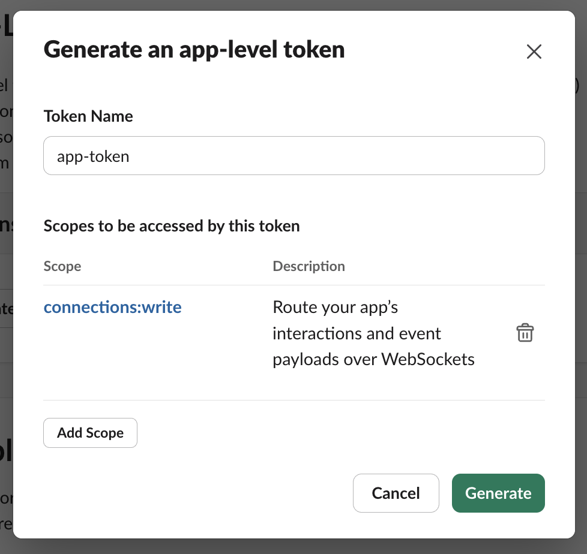
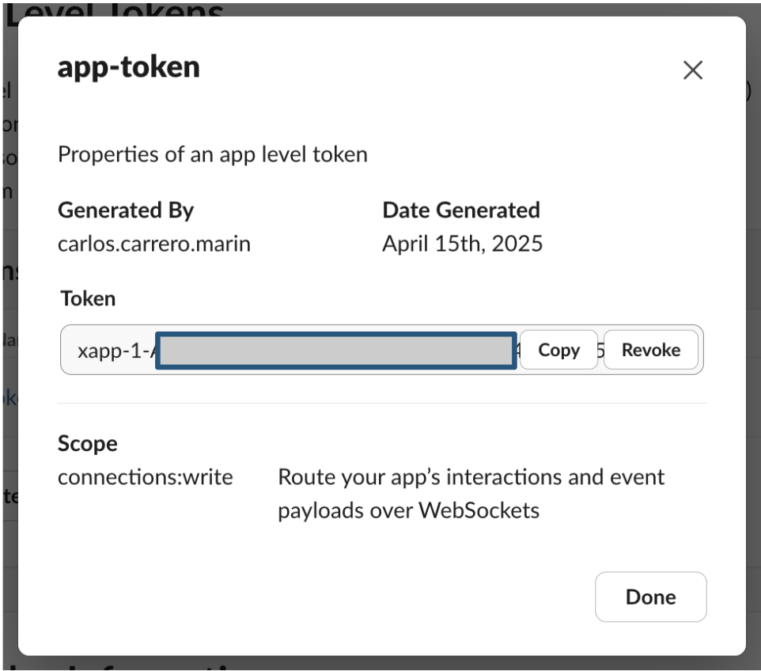

# Building Cortex Agents Hands-On Lab Slack Integration

## 1. Create your own Slack Channel

We recommend for testing you create your own private slack channel:

[Use this link to Create it](https://slack.com/get-started#create)

Get you email handy as you will receive a confirmation code.

Follow the steps to:

- Enter the name of your team (My Bikes & Ski)
- Add your name
- No need to invite anybody for now (we are just testing, click on Skip this step)
- Enter what team is working on and this will create a new channel (sales research)
- Start with the Limited Free Version

With this you should be able to have your first Slack Channel!

## 2. Create a Slack App.

This is the App that will be calling Cortex Agents API.

Click on [Create Apps](https://api.slack.com/apps?new_app=1)

Click on Create New App -> Select From scratch

Give the app a name and select the workspace you just created:

You will get in the the slack api configuration of your app with something like this:

Navigate to the **OAuth & Permissions** on the left sidebar and scroll down to the **Bot Token Scopes** section. Click **Add an OAuth Scope**.

For now, we'll just add one scope: **chat:write**. This grants your app the permission to post messages in channels it's a member of.

Scroll up to the top of the **OAuth & Permissions** page and click **Install App** to Workspace. You'll be led through Slack's OAuth UI, where you should allow your app to be installed to your development workspace.

Once you authorize the installation, you'll land on the OAuth & Permissions page and see a Bot User OAuth Access Token.

Then head over to Basic Information and scroll down under the App Token section and click Generate Token and Scopes to generate an app-level token. Add the connections:write scope to this token and save the generated xapp token, we'll use both these tokens in just a moment.

Give it a name and generate

Copy the token generated as we will be using it

Navigate to Socket Mode on the left side menu and toggle to enable.

